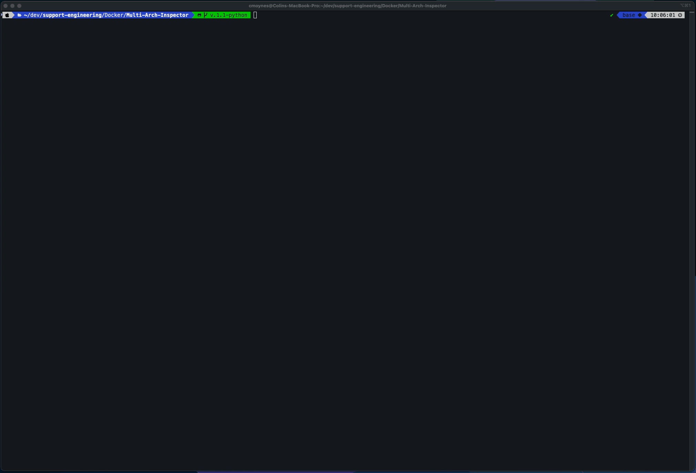

# Docker Multi-Arch Inspector

This Python script audits multi-architecture Docker images stored in your Cloudsmith repository. It interacts with both the Cloudsmith API and Docker Manifest V2 endpoints to provide a detailed analysis of your container images.

Here is a summary of its capabilities:

1. **Visualization & Hierarchy**
    - **Rich Tables:** Uses the `rich` library to render formatted, colored terminal tables.
    - **Manifest Lists:** Visually groups architecture-specific images (children) under their parent Manifest List tag.
    - **Details:** Displays the Tag, Type (manifest/list vs. image), Platform (e.g., linux/amd64, linux/arm64), Status (with icons), Download Counts, and SHA256 Digests.
2. **Inspection Modes**
    - **Single Image:** Can inspect a specific image repository (e.g., `my-org/my-repo/my-image`).
    - **Full Catalog:** If no image name is provided, it automatically fetches the catalog and scans every image in the repository.
    - **Detailed View:** The `--detailed` flag expands the output to show every individual child digest and its specific download count, rather than just the summary.
3. **Maintenance (Untagged Images)**
    - **Detection:** The `--untagged` flag scans for "orphaned" manifest lists that exist but have no version tags associated with them.
    - **Cleanup:** The `--untagged-delete` flag allows you to programmatically delete these untagged manifest lists to clean up the repository.
4. **Data Aggregation**
    - It combines data from two sources:
        - **Docker Manifests:** To determine architecture/OS platforms and digest relationships.
        - **Cloudsmith API:** To retrieve processing status (Synced, Failed, In Progress) and download statistics.

#### Query repository for images


#### Query a specific image and view detailed results. 


#### Query untagged images


## Prerequisites

1. **Python Environment**
   Ensure you have Python 3 installed and the required library:
   ```bash
   pip install rich
   ```

2. **Cloudsmith API Key**
   Configure the Cloudsmith environment variable with your PAT or Service Account Token. 
   ```bash
   export CLOUDSMITH_API_KEY=<api-key>
   ```

## How to use

1. **Basic Usage**
   Run the script targeting your Organization and Repository.

   - Scan a specific image:
     ```bash
     python3 multiarch.py my-org my-repo my-image
     ```

   - Scan ALL images in the repository:
     (Omit the image name)

2. **Advanced Flags**
   | Flag                  | Description                                                  |
   |-----------------------|--------------------------------------------------------------|
   | `--detailed`         | Shows every child digest (arch/os) and individual download counts. |
   | `--untagged`         | Finds manifest lists that have no tags (orphaned).          |
   | `--untagged-delete`  | Deletes any untagged manifest lists found.                  |

3. **Examples**
   - Get a summary of all tags for my-image:
     ```bash
     python3 multiarch.py my-org my-repo my-image
     ```

   - See full breakdown (platforms & digests) for all images:
     ```bash
     python3 multiarch.py my-org my-repo --detailed
     ```

   - Delete untagged manifest lists:
     ```bash
     python3 multiarch.py my-org my-repo my-image --untagged-delete
     ```


